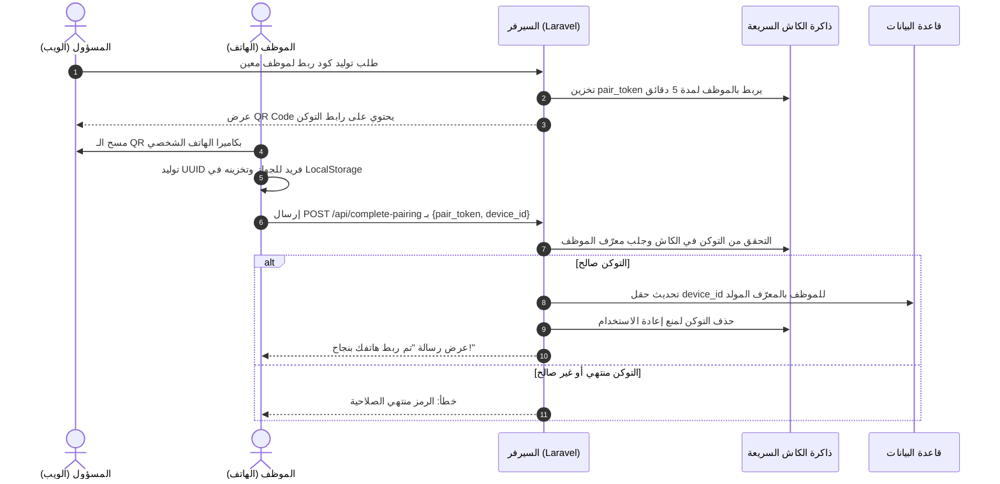
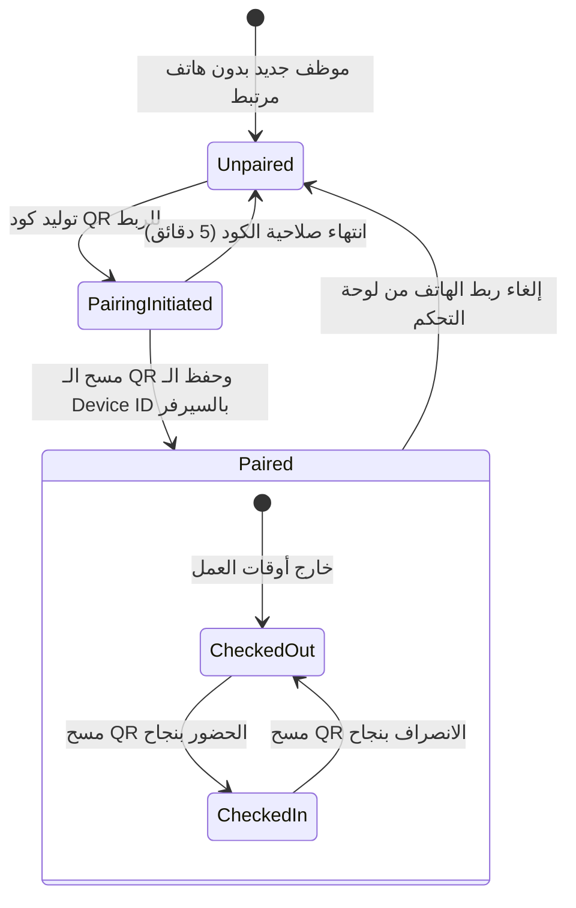
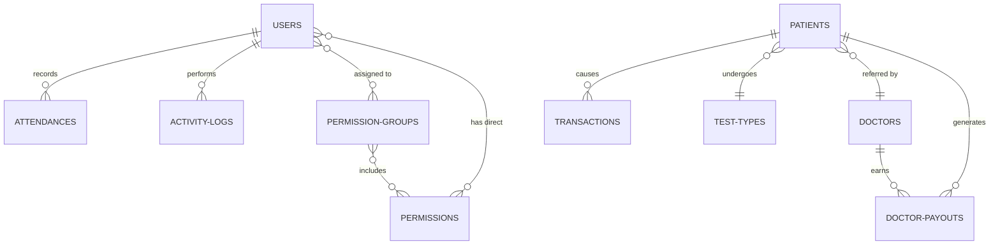

# Dar El Sama ERP - نظام إدارة عيادات دار السماء المتكامل 🏥💼

[](https://laravel.com)
[](https://php.net)
[](https://mysql.com)
[](https://developer.mozilla.org/en-US/docs/Web/JavaScript)
[](https://developer.mozilla.org/en-US/docs/Web/CSS)

نظام تخطيط موارد المؤسسات (ERP) المتكامل **"دار السماء" (Dar El Sama)** هو حل برمجي شامل ومخصص لإدارة العيادات الطبية، الموارد البشرية، تتبع الحضور والانصراف الذكي عبر الهواتف، والعمليات الحسابية والمالية بدقة متناهية. تم بناء النظام بالكامل بالاعتماد على إطار عمل **Laravel**، مع واجهات مستخدم مخصصة تعتمد على **Vanilla CSS & JavaScript** لتقديم واجهة أنيقة، سريعة واستثنائية خالية من أطر العمل الثقيلة مثل TailwindCSS، ومجهزة للعمل بكفاءة عالية على السيرفرات المحلية وبيئات الاستضافة المشتركة (Shared Hosting) كبيئة **InfinityFree**.

---

## 📋 جدول المحتويات
1. [🌟 الميزات الأساسية للنظام](#-الميزات-الأساسية-للنظام)
2. [🏗️ البنية البرمجية وهندسة النظام](#%EF%B8%8F-البنية-البرمجية-وهندسة-النظام)
3. [📂 الهيكل الدليلي للمشروع (Directory Structure)](#-الهيكل-الدليلي-للمشروع-directory-structure)
4. [⚙️ تفاصيل الموديولات ومنطق العمل (Business Logic)](#%EF%B8%8F-تفاصيل-الموديولات-ومنطق-العمل-business-logic)
   - [نظام الموارد البشرية والرواتب الذكي (HR & Smart Attendance)](#1-نظام-الموارد-البشرية-والرواتب-الذكي-hr--smart-attendance)
   - [إدارة العيادة والخدمات الطبية (Clinic Management)](#2-إدارة-العيادة-والخدمات-الطبية-clinic-management)
   - [النظام المالي والحسابات المؤتمت (Financial & Transactions Module)](#3-النظام-المالي-والحسابات-المؤتمت-financial--transactions-module)
   - [نظام الصلاحيات المتقدم (Advanced RBAC System)](#4-نظام-الصلاحيات-المتقدم-advanced-rbac-system)
   - [سجل الرقابة والنشاط (Activity Logs / Audit Trail)](#5-سجل-الرقابة-والنشاط-activity-logs--audit-trail)
5. [🌐 توثيق واجهة برمجة التطبيقات (API Documentation)](#-توثيق-واجهة-برمجة-التطبيقات-api-documentation)
6. [🗄️ معمارية قاعدة البيانات (Database Schema & Diagrams)](#%EF%B8%8F-معمارية-قاعدة-البيانات-database-schema--diagrams)
7. [🛠️ دليل التثبيت والإعداد المحلي (Local Setup Guide)](#%EF%B8%8F-دليل-التثبيت-والإعداد-المحلي-local-setup-guide)
8. [🚀 إرشادات النشر على الاستضافة المشتركة (Shared Hosting Deployment)](#-إرشادات-النشر-على-الاستضافة-المشتركة-shared-hosting-deployment)

---

## 🌟 الميزات الأساسية للنظام

*   **🔒 أمان الأجهزة المقترنة (Secure Device Binding):** يمنع تسجيل الحضور والانصراف المزيف أو الـ "Proxy Attendance" عن طريق ربط حساب الموظف بجهازه الشخصي الفريد (`device_id`). لا يمكن للموظف تسجيل حضوره إلا من جهازه الشخصي المعتمد.
*   **📱 تسجيل الحضور عبر رمز الاستجابة السريعة الديناميكي (Dynamic QR Attendance):** يقوم السيرفر بتوليد كود QR متغير باستمرار كل 15 ثانية على شاشة العرض الذكية، ويقوم الموظف بمسحه عبر هاتفه الذكي المرتبط لإثبات حضوره أو انصرافه لحظياً.
*   **💰 حساب الرواتب المؤتمت بالثانية (Time-precise Payroll):** يقوم النظام بحساب ساعات العمل الفعلية بين تسجيل الحضور والانصراف بالدقة الكاملة، وحساب الراتب المستحق ديناميكياً استناداً إلى أجر الساعة (`hourly_rate`) المحدد للموظف.
*   **🩺 إدارة طبية متكاملة (Full Clinic Lifecycle):** تتبع كشف الحالات، بيانات المرضى، الأطباء المقيمين (الداخليين) والأطباء الخارجيين (المحولين)، الفحوصات والأشعة، وزيارات مناديب الشركات الطبية.
*   **📊 أتمتة القيود المالية (Financial Ledger Automation):** بمجرد تسجيل مريض جديد، يقوم النظام تلقائياً بإنشاء القيود المالية المقابلة (إيراد الفحص، عمولات الأطباء، مصروفات المستلزمات الطبية المستهلكة) لضمان اتساق الدفاتر المالية ومنع أي خطأ بشري.
*   **📈 لوحة تحليلات وتقارير تفصيلية:** حساب الأرباح الصافية والإيرادات والمصروفات الإجمالية وتوزيع العمولات، مع إمكانية تصدير التقرير بملفات CSV متوافقة 100% مع اللغة العربية في Microsoft Excel.
*   **🔑 نظام صلاحيات متناهي الدقة (RBAC):** يدعم توزيع الموظفين على مجموعات صلاحيات (Permission Groups) أو منح صلاحيات مخصصة لكل موظف على حدة على مستوى الموديول أو العملية.
*   **🖥️ تسجيل دخول للمنصة بالهاتف (Desktop Auth QR Polling):** إمكانية تسجيل الدخول للوحة التحكم على الكمبيوتر المكتبي عن طريق مسح كود QR بالهاتف الذكي المصرح له (خاص بالمسؤولين).

---

## 🏗️ البنية البرمجية وهندسة النظام

يعتمد النظام على هندسة برمجة Laravel الكلاسيكية المتينة (MVC) مع تطبيق مبادئ **Clean Code** والتصميم المقاوم للتكرار **DRY (Don't Repeat Yourself)**:

1.  **طبقة الخدمة (Service Layer):** يتم عزل منطق العمل المالي والطبي المعقد داخل فئة الخدمة الموحدة `PatientService` لضمان استدعائه الموحد من لوحة تحكم الويب (Web Controller) ومن واجهة برمجة التطبيقات (API Controller) دون تكرار الأكواد.
2.  **طبقة التحقق المخصصة (FormRequests):** يتم فلترة وتدقيق كافة المدخلات القادمة من المستخدمين عبر كلاسات FormRequest مستقلة لضمان نوعية البيانات وأمان المدخلات.
3.  **الكاش والذاكرة السريعة (Cache-driven Tokens):** يُعتمد على نظام الكاش لتخزين رموز التحقق المؤقتة للـ QR وجلسات تسجيل الدخول السريع ومطابقتها بمعدل استجابة يقل عن أجزاء من الثانية.
4.  **طبقة الأمان والوسائط (Middleware Protection):** يُدار أمان النظام عبر وسائط مخصصة مثل `CheckPermission` للتحقق من امتلاك المستخدم للصلاحية المطلوبة قبل تنفيذ العملية أو دخول الصفحة، و `CheckAdmin` لتأمين العمليات الإدارية الحساسة.

---

## 📂 الهيكل الدليلي للمشروع (Directory Structure)

```text
dar_elsama3/
├── app/
│   ├── Http/
│   │   ├── Controllers/
│   │   │   ├── Api/               # متحكمات الـ API الخاصة بتطبيق الهاتف والـ Polling
│   │   │   │   ├── AttendanceController.php
│   │   │   │   ├── AuthController.php
│   │   │   │   ├── DelegateController.php
│   │   │   │   ├── DoctorController.php
│   │   │   │   ├── FinanceController.php
│   │   │   │   ├── GlobalSearchController.php
│   │   │   │   ├── PatientController.php
│   │   │   │   └── TestTypeController.php
│   │   │   └── Web/               # متحكمات لوحة التحكم للويب (Blade UI)
│   │   │       ├── ActivityLogController.php
│   │   │       ├── AttendanceController.php
│   │   │       ├── ClinicController.php
│   │   │       ├── DashboardController.php
│   │   │       ├── EmployeeController.php
│   │   │       ├── EmployeePermissionController.php
│   │   │       ├── FinanceController.php
│   │   │       ├── PermissionGroupController.php
│   │   │       └── SettingsController.php
│   │   ├── Middleware/            # وسائط حماية المسارات والصلاحيات
│   │   │   ├── CheckAdmin.php
│   │   │   └── CheckPermission.php
│   │   └── Requests/              # طبقة التحقق من صحة البيانات المرسلة (FormRequests)
│   │       ├── StorePatientRequest.php
│   │       ├── StoreDoctorRequest.php
│   │       ├── StoreEmployeeRequest.php
│   │       └── ...
│   ├── Models/                    # النماذج البرمجية وعلاقات الجداول (Eloquent Models)
│   │   ├── User.php
│   │   ├── Attendance.php
│   │   ├── Patient.php
│   │   ├── Doctor.php
│   │   ├── DoctorPayout.php
│   │   ├── Transaction.php
│   │   ├── ActivityLog.php
│   │   ├── Permission.php
│   │   └── ...
│   ├── Services/                  # خدمات الأعمال المشتركة وعزل الكود المعقد
│   │   └── PatientService.php
│   └── Support/                   # ملفات الدعم المساعدة والوظائف العامة
│       └── ActivityLogger.php
├── bootstrap/                     # إعدادات إقلاع الإطار وملفات التعريف الأساسية
├── config/                        # ملفات إعدادات النظام (Database, Cache, Session, App)
├── database/
│   ├── migrations/                # ملفات بناء وهندسة جداول قاعدة البيانات بالتفصيل
│   └── seeders/                   # بذور البيانات الافتراضية ومستخدمي النظام الأساسيين
├── docs/
│   └── uml/                       # ملفات الرسومات الهندسية وتدفقات العمليات (PlantUML)
├── public/                        # المجلد العام (الأصول المرئية، الصور، ملفات الـ Assets)
│   └── web/                       # ملفات الـ Vanilla CSS والتنسيقات للوحة التحكم
├── resources/
│   └── views/                     # قوالب العرض وتصميم الصفحات (Blade Templates)
│       └── web/
│           ├── activity_logs/     # واجهات تتبع العمليات
│           ├── attendance/        # واجهات تسجيل الحضور والماسح الضوئي
│           ├── clinic/            # واجهات المرضى والزيارات والمناديب
│           ├── employees/         # واجهات الموظفين وتعديل صلاحياتهم
│           ├── finance/           # واجهات التقارير المالية والرواتب وعمولات الأطباء
│           └── dashboard.blade.php
├── routes/
│   ├── api.php                    # مسارات واجهات برمجة التطبيقات الخاصة بتطبيق الهاتف والربط
│   └── web.php                    # مسارات لوحة تحكم الويب وقنوات تصفح المتصفحات
└── vite.config.js                 # أداة التجميع وبناء الملفات المساعدة
```

---

## ⚙️ تفاصيل الموديولات ومنطق العمل (Business Logic)

### 1. نظام الموارد البشرية والرواتب الذكي (HR & Smart Attendance)

يهدف هذا الموديول إلى القضاء الكامل على التزوير أو التلاعب في تسجيل أوقات الدوام.

#### أ. آلية اقتران هاتف الموظف (Device Pairing Process):
يمر اقتران الهاتف بدورة أمان مغلقة لضمان تفرد الجهاز المسجل:
1. يقوم المدير بالدخول إلى لوحة التحكم والضغط على **"توليد رمز ربط الهاتف"** لموظف محدد.
2. يقوم السيرفر بإنشاء توكن عشوائي فريد ومؤقت (`pair_token`) ويحفظه في الكاش لمدة 5 دقائق فقط مع ربطه بمعرف المستخدم في الكاش:
   ```php
   Cache::put('pair_token:' . $token, ['user_id' => $userId], 300);
   ```
3. يعرض النظام رمز الاستجابة السريعة (QR Code) يحتوي على رابط يوجه الهاتف إلى المسار العام: `/setup-phone?pair_token=XXXX`.
4. يفتح الموظف كاميرا هاتفه الذكي ويمسح الـ QR ليفتح الرابط في المتصفح المحمول.
5. تقوم واجهة الهاتف الذكي بتوليد معرف فريد غير مكرر للجهاز (`device_id`) بالاعتماد على خوارزمية UUID متقدمة وتخزنه بصورة دائمة وثابتة في الذاكرة المحلية للمتصفح `LocalStorage` للجهاز.
6. يرسل المتصفح طلباً ببيانات التوكن المؤقت والمعرف المولد إلى خادم النظام:
   `POST /api/complete-pairing {pair_token: XXXX, device_id: YYYY}`.
7. يقرأ السيرفر التوكن من الكاش، يتأكد من صلاحيته وعدم انتهاء مدته، ثم يسجل الـ `device_id` في جدول الموظف بقاعدة البيانات.
8. يتم حذف التوكن فوراً من الكاش لمنع استغلاله مرة أخرى (One-Time token).



#### ب. آلية تسجيل الحضور والانصراف اليومي (QR Attendance Flow):
عند الوقوف أمام شاشة العرض الذكية بالمقر:
1. تعرض الشاشة كود QR ديناميكي يتغير تلقائياً كل 15 ثانية. الكود يتألف من توكن أساسي متبوع بلاحقة تحدد العملية (`_in` للحضور، و `_out` للانصراف).
2. يفتح الموظف كاميرا التطبيق أو هاتفه ويمسح الـ QR. يوجهه المتصفح إلى صفحة التأكيد التي تقرأ الـ `device_id` المخزن سابقاً في الذاكرة المحلية للجهاز.
3. يرسل الهاتف طلباً للخادم لإثبات العملية:
   `POST /api/attend {user_id: 5, qr_content: token_in, device_id: YYYY}`.
4. **مرحلة التحقق على السيرفر:**
   *   يتأكد السيرفر من وجود الموظف وصلاحية حسابه النشط (`is_active = true`).
   *   يقارن الـ `device_id` الوارد بالمسجل مسبقاً في قاعدة بيانات هذا الموظف. في حال عدم التطابق يرفض السيرفر فوراً العملية ويعتبرها محاولة دخول غير مصرح بها.
   *   يستخرج التوكن الأساسي ويفصل اللاحقة (`_in` أو `_out`).
   *   يقارن التوكن الأساسي بالتوكن المخزن في الكاش المركزي (`current_qr_token`). إذا اختلف أو انتهت الـ 15 ثانية، يتم رفض الحضور واعتباره كوداً تالفاً أو منتهي الصلاحية لمنع التقاط صور للشاشة وتسجيل الحضور من المنزل.
5. في حال النجاح، يتم تسجيل العملية في جدول `attendances` بالوقت والتاريخ الفعلي.



#### ج. حساب الأجور التلقائي (Automated Payroll):
النظام لا يعتمد على فترات عمل تقريبية بل يحسب الثواني بدقة:
*   **ساعات العمل:** `عدد الساعات = (وقت الانصراف بالثواني - وقت الحضور بالثواني) / 3600`.
*   **حساب الراتب المكتسب يومياً:** `الراتب المستحق = عدد الساعات * أجر الساعة الفردي للموظف (hourly_rate)`.
*   يتم تجميع كافة الحركات وعرض صافي الراتب المستحق في قائمة الرواتب ولوحة تحكم الإدارة المالية للمدراء تلقائياً.

---

### 2. إدارة العيادة والخدمات الطبية (Clinic Management)

يمثل الموديول الطبي حجر الأساس في توفير الرعاية الصحية وتوثيق الحركات الطبية والزيارات:
*   **ملف المرضى (Patients):** يسجل معلومات المرضى، السن، وسجل الفحوصات والتحاليل المطلوبة وتكلفتها والمستلزمات الطبية المستهلكة في الكشف الطبي.
*   **ملف الأطباء (Doctors):** يقسم الأطباء إلى نوعين:
    1.  **طبيب داخلي (Internal Doctor):** وهو طبيب المركز الذي يباشر الفحوصات والكشف الفعلي.
    2.  **طبيب محول (External/Referring Doctor):** وهو الطبيب الخارجي الذي قام بتحويل المريض إلى مركز دار السماء لإجراء فحوصات/أشعة محددة.
*   **إدارة الفحوصات والتحاليل (Test Types):** تتيح للمدير إضافة كافة التحاليل والفحوصات وتحديد السعر الافتراضي لكل فحص.
*   **تتبع المناديب (Delegates & Visits):** يسمح بتسجيل مناديب شركات الأدوية والمستلزمات الطبية ومتابعة زياراتهم الميدانية لتقديم عروضهم وتدوين الملاحظات.

---

### 3. النظام المالي والحسابات المؤتمت (Financial & Transactions Module)

تم تصميم النظام المالي ليعمل كـ **مساعد محاسبي متكامل (Automated Accountant)** يربط الحركات الطبية بالقيود المحاسبية تلقائياً ودون أي فرصة للاختلاف المالي.

#### أ. تدفق البيانات المؤتمت الموحد (Automated Transaction Logging):
عوضاً عن قيام المحاسب بتسجيل الحسابات يدوياً، فإن تسجيل مريض جديد عبر طبقة الخدمة الموحدة `PatientService::createPatient` يقوم تلقائياً بالعمليات التالية تحت معاملة قاعدة بيانات متسقة (DB Transaction) تضمن حفظ الكل أو التراجع عن الكل في حال حدوث عطل:
1.  **تسجيل الإيراد (Income):** يُنشأ قيد إيراد جديد في جدول الحركات المالية `transactions` بقيمة سعر الفحص (`test_price`) تحت تصنيف `test_revenue`.
2.  **حساب عمولات الأطباء (Doctor Commissions):** يتم احتساب عمولة الطبيب الداخلي والطبيب الخارجي تلقائياً بناءً على نوع عمولة الطبيب في ملفه الشخصي (نسبة مئوية `Percentage` أو مبلغ مقطوع `Flat`).
3.  **تسجيل مستحقات الأطباء (Doctor Payouts):** تُسجل العمولات المحسوبة في جدول مستحقات الأطباء `doctor_payouts` كأرصدة غير مدفوعة (`is_paid = false`).
4.  **تسجيل حركات المصروفات التلقائية (Expense Payouts):** يتم تسجيل خروج مبلغ عمولة الطبيب الداخلي والخارجي تلقائياً كـ `payout` تحت تصنيف `doctor_commission` لتتبع صافي الأرباح.
5.  **مصروفات المستلزمات الطبية (Medical Supplies Cost):** إذا تم تحديد تكلفة للمواد المستهلكة في الفحص (`supplies_cost`)، يتم قيدها تلقائياً كمصروف في الحسابات تحت تصنيف `medical_supplies`.

#### ب. تتبع وصرف مستحقات الأطباء:
*   يوفر النظام واجهة خاصة لمراجعة كافة العمولات المستحقة للأطباء وتصفيتها حسب حالة الدفع (مدفوع / غير مدفوع).
*   يدعم النظام **الدفع الفردي** المباشر لكل كشف بضغطة زر للتأكيد الفردي لكل حركة، أو **الدفع الجماعي** (Bulk Payout Processing) عن طريق تظليل الخانات المطلوبة وتأكيد صرفها دفعة واحدة.

#### ج. التقارير المالية وتصدير البيانات:
*   يقدم محرك التقارير تحليلات دقيقة تشمل: (إجمالي الإيرادات، إجمالي المصروفات، إجمالي عمولات الأطباء، وصافي الأرباح الفعلي لمركز دار السماء).
*   يقوم محرك التقارير بتوليد رسم بياني تفاعلي يوضح التدفق المالي النقدي اليومي (Daily Cashflow) خلال أي فترة زمنية يحددها المستخدم.
*   **التصدير إلى إكسل (CSV Export):** يدعم تصدير تقرير تفصيلي دقيق يحتوي على إجماليات الإيرادات والمصروفات والأرباح مع كشف تفصيلي بحالات المرضى، أسماء الأطباء وتفصيل عمولاتهم. التصدير محصن بترميز **UTF-8 BOM** لتفادي مشكلة تشوه الحروف العربية عند فتح التقرير ببرنامج Excel:
    ```php
    fwrite($file, "\xEF\xBB\xBF"); // يضمن فتح ملف الحسابات باللغة العربية بامتياز
    ```

---

### 4. نظام الصلاحيات المتقدم (Advanced RBAC System)

يشتمل النظام على آلية حماية فائقة الدقة للتحكم في وصول الموظفين لأجزاء النظام من خلال نظام **التحكم بالوصول القائم على الدور والصلاحيات (Role-Based Access Control)**.

#### أ. الصلاحيات وجداولها:
يقسم النظام الصلاحيات إلى مستويين:
1.  **مجموعات الصلاحيات (Permission Groups):** كإنشاء مجموعة باسم "المحاسبون" وإسناد صلاحيات المالية والتقارير لها، ومن ثم إسناد الموظف إلى هذه المجموعة ليرث كامل صلاحياتها تلقائياً.
2.  **الصلاحيات المباشرة (Direct User Permissions):** وهي صلاحيات تُمنح للموظف مباشرة بصورة استثنائية لتميز حسابه الفردي.

#### ب. أداء استعلامات الصلاحيات وتفادي N+1:
عندما يقوم النظام بالتحقق من صلاحية مستخدم عبر البوابة `hasPermission($name)`، فإنه يقوم بتحميل وتجميع كافة صلاحياته (المباشرة والمكتسبة من المجموعات) مرة واحدة فقط طوال فترة معالجة الطلب (Request Lifecycle) ويحفظها في مصفوفة كاش مؤقتة داخل الكائن لمنع حدوث استعلامات متكررة لقاعدة البيانات عند فحص أكثر من عملية بنفس الصفحة:
```php
protected ?array $cachedPermissionNames = null;

protected function resolvedPermissionNames(): array
{
    if ($this->cachedPermissionNames === null) {
        $direct = $this->permissions()->pluck('name')->all();

        $fromGroups = $this->permissionGroups()
            ->with('permissions:id,name')
            ->get()
            ->flatMap(fn ($group) => $group->permissions->pluck('name'))
            ->all();

        $this->cachedPermissionNames = array_unique(array_merge($direct, $fromGroups));
    }
    return $this->cachedPermissionNames;
}
```

#### ج. قائمة الصلاحيات البرمجية المتاحة بالنظام:
يتوفر في النظام **19 صلاحية تحكم** دقيقة تغطي كافة الجوانب:

| كود الصلاحية (System Code) | اسم الصلاحية بالعربية | المهام المسموحة |
| :--- | :--- | :--- |
| `module_patients` | المرضى | استعراض قائمة سجلات المرضى |
| `module_patients_delete` | حذف المرضى | حذف سجل مريض وسجلاته المالية المقابلة |
| `module_doctors` | الأطباء | استعراض وإضافة وتعديل بيانات الأطباء وعمولاتهم |
| `module_doctors_delete` | حذف الأطباء | حذف كائن طبيب من النظام |
| `module_test_types` | أنواع الفحوصات | مراجعة أسعار الفحوصات وإدارتها |
| `module_test_types_delete` | حذف أنواع الفحوصات | حذف نوع فحص من لوحة التحكم |
| `module_delegates` | المناديب | إدارة مناديب شركات الأدوية والمستلزمات |
| `module_delegates_delete` | حذف المناديب | حذف بيانات مندوب من النظام |
| `module_finance` | المالية | مراجعة الحركات المالية، المصروفات، وعمولات الأطباء |
| `module_employees` | قائمة الموظفين وصلاحياتهم | إضافة موظفين جدد وربط وإلغاء هواتفهم |
| `module_employees_delete` | حذف حسابات موظفين | شطب مستخدم نهائياً من قاعدة البيانات |
| `module_activity_logs` | سجل النشاط | الاطلاع على الرقابة وسجل التغييرات الكامل للعمليات |
| `module_attendance` | الحضور | مراقبة أوقات دوام الموظفين وتعديلها وعرض شاشة الـ QR |
| `module_settings` | الإعدادات | تعديل بيانات المركز، وتغيير كلمات المرور الإدارية |
| `view_reports` | تقارير لوحة التحكم | استعراض الرسوم البيانية والأرباح والخسائر للمركز |
| `edit_tests` | تعديل الفحوصات | إمكانية تعديل تسعير الفحوصات المقررة |
| `view_finances` | عرض المالية | إمكانية رؤية الخزينة بدون إجراء حركات يدوية |
| `edit_employees` | تعديل الموظفين | تعديل الرواتب وأوقات دوام الموظف |
| `view_attendance` | عرض الحضور | الاطلاع على أوقات الحضور بدون التحكم بالماسح |

*تنبيه هام:* يتمتع الحساب الحامل لدور **المسؤول العام (`role = admin`)** بتخطي تلقائي لكافة التحققات حيث يملك صلاحية مطلقة للقيام بكافة العمليات افتراضياً.

---

### 5. سجل الرقابة والنشاط (Activity Logs / Audit Trail)

النظام مزود بآلية رقابة صارمة تسجل كل حركة يقوم بها أي مستخدم داخل النظام لضمان الشفافية والأمان الكامل.
*   **متحكم التسجيل الذاتي (`ActivityLogger`):** كلاس مستقل يقوم بتسجيل الإجراءات بصورة خلفية غير معطلة للعملية الرئيسية في حال حدوث أي خلل في قاعدة بيانات التتبع.
*   **البيانات المسجلة:**
    1.  المستخدم المنفذ للعملية ومستوى صلاحيته.
    2.  توصيف تفصيلي باللغة العربية للإجراء المتخذ.
    3.  نوع الجدول المتأثر (`subject_type`) ومعرف السجل المتأثر بالعملية (`subject_id`).
    4.  عنوان بروتوكول الإنترنت الخاص بجهاز المستخدم (`ip`).
    5.  الخصائص والبيانات الإضافية الملحقة في مصفوفة JSON متكاملة (`properties`).

---

## 🌐 توثيق واجهة برمجة التطبيقات (API Documentation)

يدعم النظام واجهة برمجة تطبيقات (RESTful API) متطورة وسريعة مبنية بالكامل باستخدام **Laravel Sanctum** لإصدار الرموز الأمنية الموثوقة لتطبيقات الهواتف المحمولة.

### أ. مسارات تسجيل الدخول والربط (العامة):
*   `GET /api/has-admins`: للتحقق مما إذا كان هناك مسؤولين مسجلين في النظام لتوجيه عملية التثبيت الأولية.
*   `GET /api/auth-qr`: لتوليد توكن تسجيل الدخول عبر مسح كود الـ QR من الكمبيوتر المكتبي باستخدام تطبيق هاتف المسؤول.
*   `GET /api/auth-poll/{token}`: استعلام متكرر (Long Polling) للتحقق مما إذا كان المسؤول قد وافق على جلسة الدخول من هاتفه وتمرير رمز الـ Access Token للكمبيوتر تلقائياً.
*   `POST /api/login`: تسجيل دخول الموظف باستخدام الإيميل، الباسورد، ومعرف الجهاز (`device_id`). يتم فلترتها ومنع الدخول في حال اختلاف معرّف الجهاز المخزن.
*   `POST /api/attend`: إرسال حركة حضور أو انصراف وتمرير معطيات الهاتف والرمز. محمي بـ Rate Limiter صارم لمنع هجمات التخمين.
*   `POST /api/complete-pairing`: إتمام عملية ربط هاتف الموظف بحسابه وتوثيق الـ `device_id` للأبد.

### ب. المسارات المحمية بصلاحيات (تتطلب ترويسة `Authorization: Bearer <Token>`):
*   `GET /api/user`: جلب بيانات الموظف الحالي وصلاحياته المتاحة.
*   `POST /api/auth-authorize`: يقوم المسؤول بالتحقق والموافقة على طلب دخول الكمبيوتر المحتوي على التوكن الممرر.
*   `Resource /api/doctors`: العمليات الطبية (إضافة، تعديل، حذف، جلب) الأطباء.
*   `Resource /api/test-types`: العمليات الطبية للفحوصات والتحاليل الطبية وتكلفة كل فحص.
*   `Resource /api/patients`: إدارة المرضى وحساب عمولاتهم وحركاتهم المالية.
*   `Resource /api/delegates`: تتبع قائمة المناديب وزيارات الشركات الميدانية.

---

## 🗄️ معمارية قاعدة البيانات (Database Schema & Diagrams)

تم تخطيط قاعدة البيانات بدقة لضمان تكامل العلاقات ومنع تكرار البيانات مع تعيين الفهارس الصحيحة لتسريع عمليات البحث المحاسبية والطبيّة.

### العلاقات المحورية بين الكيانات البرمجية (Core Eloquent Relations):
1.  **بين المستخدمين وعمليات الحضور والغياب:**
    *   علاقة رأس بأطراف: كل مستخدم يملك سجلات حضور متعددة (`User hasMany Attendance`).
2.  **بين الأطباء والعمولات المستحقة:**
    *   علاقة رأس بأطراف: كل طبيب يملك كشوفات دفع متعددة مقيدة باسمه (`Doctor hasMany DoctorPayout`).
3.  **بين مستحقات الأطباء والمرضى:**
    *   علاقة انتماء: كل عمولة مستحقة مسجلة ترتبط بمريض محدد تم إجراء الفحص له (`DoctorPayout belongsTo Patient`).
4.  **بين الموظفين وسجل النشاط:**
    *   علاقة رأس بأطراف: كل حركة مسجلة في نظام المراقبة تنتمي للموظف الذي قام بها (`User hasMany ActivityLog`).
5.  **نظام الصلاحيات المتعدد:**
    *   علاقة أطراف بأطراف: يملك المستخدمون صلاحيات متعددة مباشرة عبر جدول وسيط `user_permissions` وصلاحيات عبر مجموعات الصلاحيات الممثلة بجدول `permission_group_user`.



---

## 🛠️ دليل التثبيت والإعداد المحلي (Local Setup Guide)

لتشغيل المشروع على جهازك المحلي للتطوير والاختبار، اتبع الخطوات التالية بالتفصيل:

### 1. المتطلبات الأساسية (Prerequisites):
*   PHP الإصدار **8.2** أو أحدث.
*   قاعدة بيانات MySQL الإصدار **8.0** أو أحدث.
*   أداة إدارة الحزم **Composer** الخاصة بـ PHP.
*   أداة إدارة الحزم **Node.js & NPM** لبناء الأصول البرمجية.

### 2. خطوات التثبيت:
1.  **استنساخ المشروع:**
    ```bash
    git clone https://github.com/nour195205/dar_elsama3_erp.git
    cd dar_elsama3_erp
    ```
2.  **تثبيت حزم المخدم المعتمدة (PHP Dependencies):**
    ```bash
    composer install
    ```
3.  **تثبيت حزم الواجهات المعتمدة (Frontend Dependencies):**
    ```bash
    npm install
    ```
4.  **إعداد ملف البيئة:**
    قم بنسخ ملف الإعداد الافتراضي وتعديل بيانات الاتصال بقاعدة البيانات الخاصة بجهازك المحلي:
    ```bash
    cp .env.example .env
    ```
5.  **توليد مفتاح تشفير التطبيق الأمن:**
    ```bash
    php artisan key:generate
    ```
6.  **تغذية وإنشاء قاعدة البيانات والجداول والبذور الافتراضية:**
    ```bash
    php artisan migrate --seed
    ```
7.  **بناء ملفات الواجهة والـ Vanilla CSS:**
    ```bash
    npm run dev
    ```
8.  **تشغيل سيرفر التطوير المحلي:**
    ```bash
    php artisan serve
    ```
    *يمكنك الآن تصفح النظام محلياً عبر الرابط المباشر: `http://localhost:8000`*

### 🚀 ملف التشغيل السريع لبيئة ويندوز (`run_app.bat`):
يشتمل مجلد المشروع على سكربت تشغيل سريع ومباشر على أنظمة Windows. بمجرد الضغط عليه نقرتين، يقوم تلقائياً ببدء تشغيل سيرفر الـ PHP وسيرفر الـ Vite معاً بضغطة زر واحدة لتسهيل العمل:
```batch
start php artisan serve
start npm run dev
```

---

## 🚀 إرشادات النشر على الاستضافة المشتركة (Shared Hosting Deployment)

تمت تهيئة نظام "دار السماء" ليعمل بأعلى كفاءة وسرعة استجابة على سيرفرات الاستضافة المشتركة البسيطة مثل **InfinityFree** وغيرها دون الحاجة للوصول لسيرفر كامل (VPS). يرجى اتباع التعليمات التالية بدقة لضمان تشغيل النظام بأمان:

### 1. توجيه الطلبات مجاناً ودون تغيير هيكل المجلدات (Public Routing Fix):
تطلب الاستضافات المشتركة عادة توجيه كافة طلبات المتصفح إلى مجلد `/public` الداخلي. لمنع ظهور أخطاء أو اضطرار المطور لنقل الملفات خارج مسارها البرمجي، تم إدراج ملف `.htaccess` مخصص في الجذر الرئيسي للمشروع يقوم بإعادة توجيه كافة الطلبات بذكاء وبصورة تلقائية:
```apache
<IfModule mod_rewrite.c>
    RewriteEngine On
    RewriteRule ^(.*)$ public/$1 [L]
</IfModule>
```
*ملاحظة هامة:* تأكد من تفعيل وحدة `mod_rewrite` في لوحة تحكم الاستضافة الخاصة بك.

### 2. إعداد محرك الكاش للمستندات السريعة (Token Caching Issue):
تفتقد الاستضافات المشتركة عادة إلى محركات ذاكرة متطورة مثل Redis أو Memcached. نظراً لأن نظام توليد الـ QR وبطاقات التحقق اليومية يعتمد بشكل أساسي على الذاكرة السريعة، يجب عليك تعديل محرك الكاش في ملف `.env` الخاص بالإنتاج ليعتمد على محرك الملفات المحلي، والذي تم تأمينه بصورة استثنائية:
```env
CACHE_STORE=file
CACHE_DRIVER=file
```
يضمن هذا الإعداد استقرار الرموز الأمنية للـ QR وتجنب فقدان جلسات الهاتف للموظفين أثناء عمليات مسح الكود اليومية.

### 3. استثناء مسارات تطبيق الهاتف من قيود الحماية العامة:
لتجنب توجيه الموظفين إلى صفحة تسجيل الدخول العادية للويب عند مسح أكواد الـ QR، تم عزل وتأمين مسارات تسجيل الحضور والاقتران مثل (`/attend-process` و `/setup-phone`) في ملف تعريف المسارات `web.php` لتكون مسارات عامة ومتاحة للجميع ومستثناة من وسيط الحماية التابع لصفحات الإدارة الداخلية، مع حمايتها برمجياً داخلياً بواسطة مطابقة الـ `device_id` والـ `qr_token` لضمان الأمان والسرعة.

### 4. تحديثات تعديل قوالب العرض (Blade Views Cache):
عند رفع تغييرات أو تعديلات على ملفات تصميم الصفحات (Blade Files) وتنسيقات الـ CSS عبر الـ FTP للاستضافة ولم تظهر التعديلات فوراً، قم بالدخول إلى إدارة الملفات وحذف كافة ملفات الكاش المخزنة داخل المسار التالي ليقوم Laravel بإعادة بنائها فوراً:
`storage/framework/views/`

---
*تم تطوير وصيانة نظام دار السماء للـ ERP بأحدث التقارير البرمجية ليكون الحل الأمثل والأذكى لإدارة كافة العمليات والوصول لأعلى مستويات الكفاءة الإدارية والمالية.*
